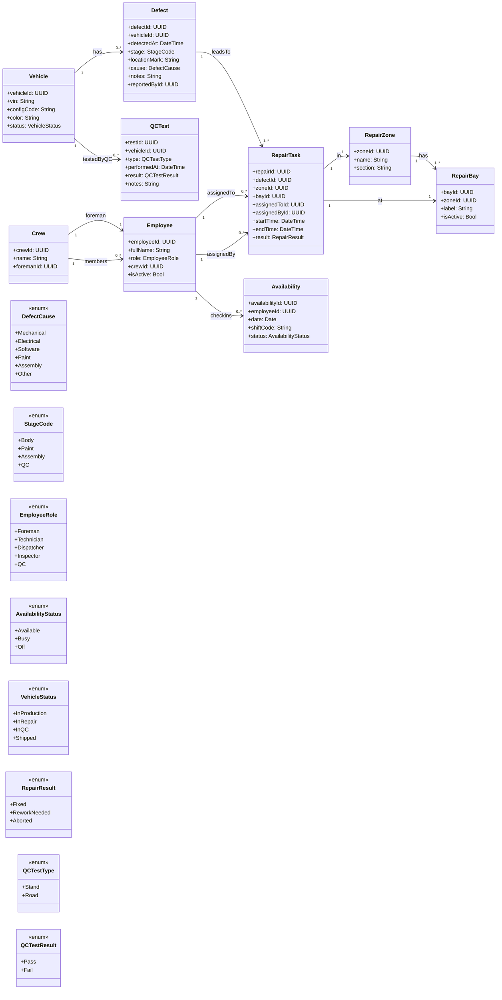

```mermaid
classDiagram
direction LR

class Vehicle {
  +vehicleId: UUID
  +vin: String
  +configCode: String
  +color: String
  +status: VehicleStatus
}

class Defect {
  +defectId: UUID
  +vehicleId: UUID
  +detectedAt: DateTime
  +stage: StageCode
  +locationMark: String
  +cause: DefectCause
  +notes: String
  +reportedById: UUID
}

class RepairTask {
  +repairId: UUID
  +defectId: UUID
  +zoneId: UUID
  +bayId: UUID
  +assignedToId: UUID
  +assignedById: UUID
  +startTime: DateTime
  +endTime: DateTime
  +result: RepairResult
}

class RepairZone {
  +zoneId: UUID
  +name: String
  +section: String
}

class RepairBay {
  +bayId: UUID
  +zoneId: UUID
  +label: String
  +isActive: Bool
}

class Employee {
  +employeeId: UUID
  +fullName: String
  +role: EmployeeRole
  +crewId: UUID
  +isActive: Bool
}

class Crew {
  +crewId: UUID
  +name: String
  +foremanId: UUID
}

class Availability {
  +availabilityId: UUID
  +employeeId: UUID
  +date: Date
  +shiftCode: String
  +status: AvailabilityStatus
}

class QCTest {
  +testId: UUID
  +vehicleId: UUID
  +type: QCTestType
  +performedAt: DateTime
  +result: QCTestResult
  +notes: String
}

Vehicle "1" --> "0..*" Defect : has
Defect "1" --> "1..*" RepairTask : leadsTo
RepairZone "1" --> "1..*" RepairBay : has
RepairTask "1" --> "1" RepairZone : in
RepairTask "1" --> "1" RepairBay : at
Employee "1" --> "0..*" RepairTask : assignedTo
Employee "1" --> "0..*" RepairTask : assignedBy
Crew "1" --> "1" Employee : foreman
Crew "1" --> "0..*" Employee : members
Employee "1" --> "0..*" Availability : checkins
Vehicle "1" --> "0..*" QCTest : testedByQC

class DefectCause {
<<enum>>
+Mechanical
+Electrical
+Software
+Paint
+Assembly
+Other
}
class StageCode {
<<enum>>
+Body
+Paint
+Assembly
+QC
}
class EmployeeRole {
<<enum>>
+Foreman
+Technician
+Dispatcher
+Inspector
+QC
}
class AvailabilityStatus {
<<enum>>
+Available
+Busy
+Off
}
class VehicleStatus {
<<enum>>
+InProduction
+InRepair
+InQC
+Shipped
}
class RepairResult {
<<enum>>
+Fixed
+ReworkNeeded
+Aborted
}
class QCTestType {
<<enum>>
+Stand
+Road
}
class QCTestResult {
<<enum>>
+Pass
+Fail
}
```
