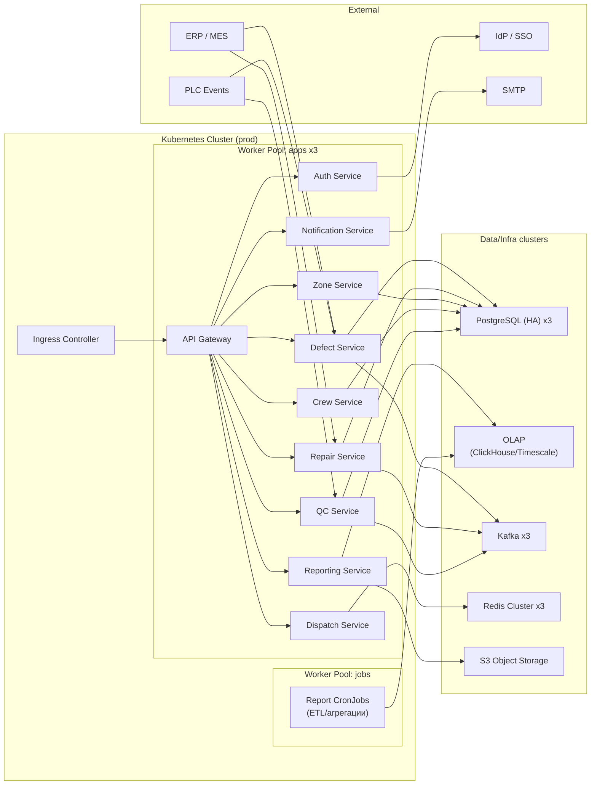

```mermaid
flowchart LR
%% Узлы/серверы
subgraph K8S["Kubernetes Cluster (prod)"]
  direction TB
  subgraph APP["Worker Pool: apps x3"]
    GW["API Gateway"]
    AUTH["Auth Service"]
    DEFECT["Defect Service"]
    REPAIR["Repair Service"]
    ZONES["Zone Service"]
    CREW["Crew Service"]
    QC["QC Service"]
    DISPATCH["Dispatch Service"]
    REPORT["Reporting Service"]
    NOTIF["Notification Service"]
  end
  subgraph JOBS["Worker Pool: jobs"]
    CRON["Report CronJobs<br/>(ETL/агрегации)"]
  end
  INGRESS["Ingress Controller"]
end

subgraph DATA["Data/Infra clusters"]
  PG["PostgreSQL (HA) x3"]
  OLAP["OLAP <br/> (ClickHouse/Timescale)"]
  BUS["Kafka x3"]
  REDIS["Redis Cluster x3"]
  S3["S3 Object Storage"]
end

subgraph EXT["External"]
  MES["ERP / MES"]
  PLC["PLC Events"]
  IDP["IdP / SSO"]
  SMTP["SMTP"]
end

%% Связи
INGRESS --> GW
GW --> AUTH --> IDP
GW --> DEFECT --> PG
GW --> REPAIR --> PG
GW --> ZONES --> PG
GW --> CREW  --> PG
GW --> QC    --> PG
GW --> DISPATCH --> REDIS
GW --> REPORT --> OLAP
GW --> NOTIF --> SMTP

DEFECT --> BUS
REPAIR --> BUS
QC --> BUS

REPORT --> S3
CRON --> OLAP

MES --> DEFECT
MES --> REPAIR
PLC --> DEFECT
PLC --> QC
```
