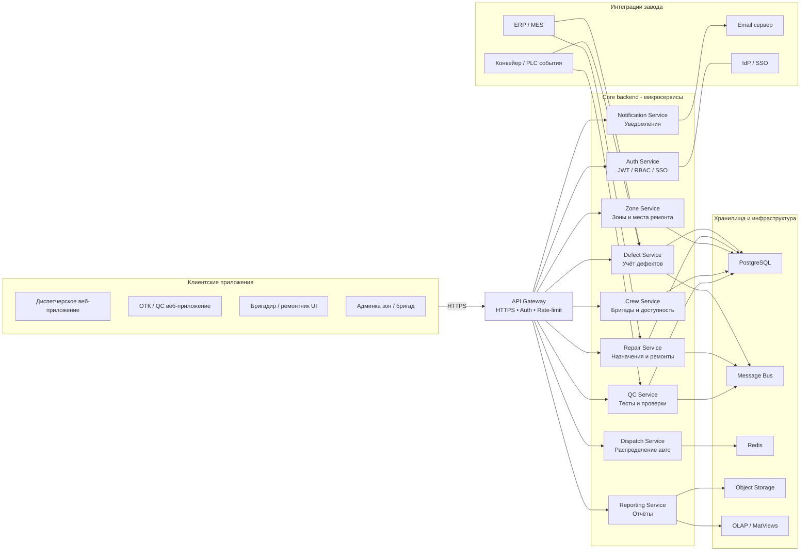

```mermaid
flowchart LR
 subgraph UIs["Клиентские приложения"]
        DIR["Диспетчерское веб-приложение"]
        QCI["ОТК / QC веб-приложение"]
        FRM["Бригадир / ремонтник UI"]
        ADM["Админка зон / бригад"]
  end
 subgraph CORE["Core backend - микросервисы"]
        AUTH["Auth Service <br/> JWT / RBAC / SSO"]
        DEFECT["Defect Service <br/> Учёт дефектов"]
        REPAIR["Repair Service <br/> Назначения и ремонты"]
        ZONES["Zone Service <br/> Зоны и места ремонта"]
        CREW["Crew Service <br/> Бригады и доступность"]
        QC["QC Service <br/> Тесты и проверки"]
        DISPATCH["Dispatch Service <br/> Распределение авто"]
        REPORT["Reporting Service <br/> Отчёты"]
        NOTIF["Notification Service <br/> Уведомления"]
  end
 subgraph DATA["Хранилища и инфраструктура"]
        DB["PostgreSQL"]
        BUS["Message Bus"]
        CACHE["Redis"]
        OBJ["Object Storage"]
        OLAP["OLAP / MatViews"]
  end
 subgraph EXT["Интеграции завода"]
        MES["ERP / MES"]
        PLC["Конвейер / PLC события"]
        SMTP["Email сервер"]
        IDP["IdP / SSO"]
  end
    UIs -- HTTPS --> GW["API Gateway <br/> HTTPS • Auth • Rate-limit"]
    GW --> AUTH & DEFECT & REPAIR & ZONES & CREW & QC & DISPATCH & REPORT & NOTIF
    AUTH --- IDP
    DEFECT --> DB & BUS
    REPAIR --> DB & BUS
    ZONES --> DB
    CREW --> DB
    QC --> DB & BUS
    REPORT --> OLAP & OBJ
    DISPATCH --> CACHE
    NOTIF --> SMTP
    MES --> DEFECT & REPAIR
    PLC --> DEFECT & QC
```
