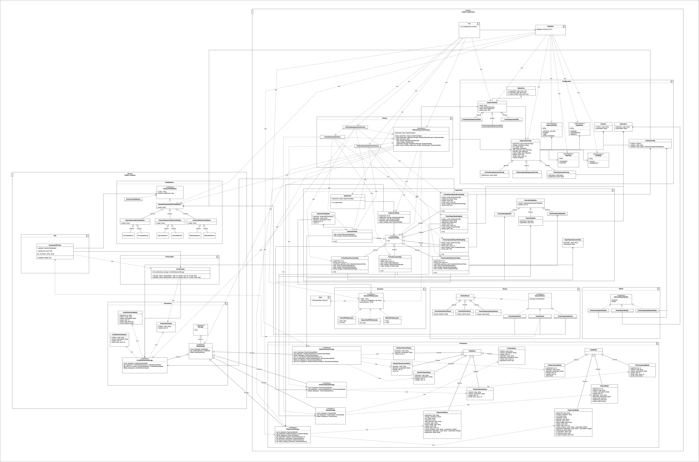

# Разбор безумных диаграм

Да этой диаграмме описана:

## Система тестирования статистических экспериметов

Систем позволяет создать эксперимент `Experiment`, который выполняет вычисления над выборками случайных величин `RVS` (возможно сгенерированных), после чего над результатами эксперимета проводятся какие-то вычисления, которые сохраняются в базу данных эксперимантов.

Запускается это программа через CLI, при запуске указывается хранилище, куда нужно записать результаты эксперимента.

### Experiment

Состоит из 3 шагов \[Генерация данных | Подсчёт вечилин в рамках эксперимента | Генерация отчёта\], а также из метаданных экспериманта, таких как \[ Перезаписывать ли предыдущий эксперимент с такими же командами | Размер выборки | Использовать ли метод Монте Карло \].

#### Генераторы выборок

- Нормальное распределение
- Экспоненциальное распределение
- Распределение Вейбулла

### Persistance

Описывает набор классов очень похожий на ORM для данных экспериментов. Кроме того этот модуль представляет доступы и к классам запросов, вероятно таким классом может быть, например, SQL запрос.

Абстрактный интерфейс хранилища позволяет абстрагироваться от используемой базы данных.

### Вспомогательные модули

Часть модулей является вспомогательными и помогаю описать как выглядят предикаты и высленяи метрик в рамках экспериметов.
