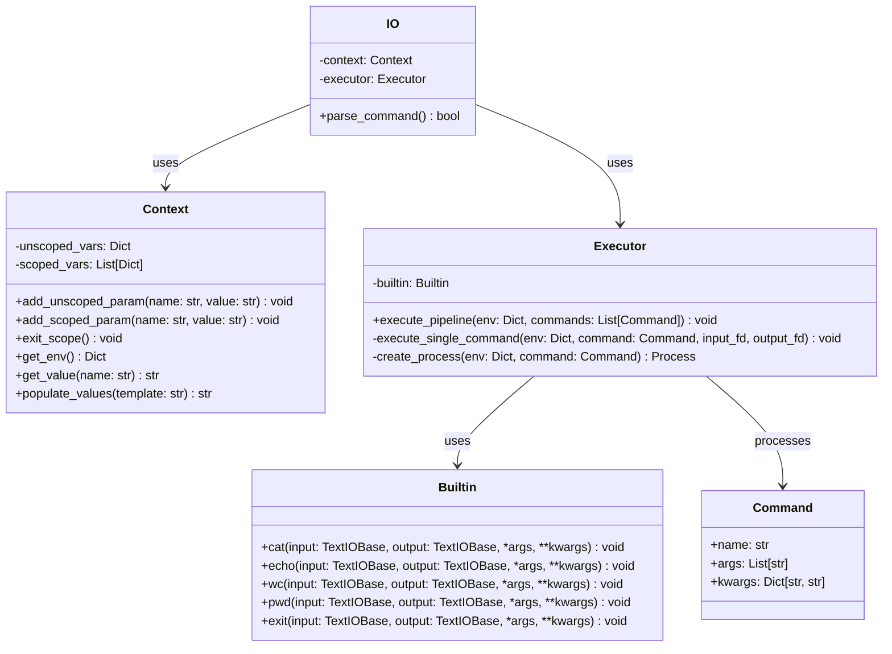

# CLI

### Общая архитектура проекта

#### Требования к проекту

- Поддержка встроенных команд `cat [FILE]`, `echo`, `wc [FILE]`, `pwd` и `exit`. Если вызванной команды нет в списке встроенных, то вызывать через `Process`.
- Поддержка операторов `''`, `""`, `$` и `|`. (Одинарные кавычки не поддерживают использование оператора `${}`).
- Поддержка переменных окружения, которые задаются с помощью оператора `name=variable`. Может быть только в начале строки, если после идёт команда, то переменная будет доступна только для этой команды.

#### Модули программы

- `IO` - превращает текст в готовую к исполнению команду, вызывает все остальные модули. Публичный интерфейс:

  
  - `def read_command(self) -> str` - Считывает команду из stdin и сохраняет ее в строку. 
  - `def tokenize(self, patterns: list[re.Pattern], command) -> list[str]` - Разбивает команду на токены.
  - `def consume_defenitions(self, tokens: list[str]) -> tuple[dict[str, str], list[str]]` - Идет по токенам, выделяет среди них определения переменных и сохраняет значения в context. Остальное передает дальше. 
  - `def consume_command(self, tokens: list[str]) -> tuple[models.Command, list[str]]` - Идет по токенам, выделяет первую команду и возвращает ее как объект Command. Возвращает оставшиеся токены. 
  - `def populate(self, value: str) -> str` - Вызывает `context.populate_values`
  - `def parse_command() -> bool` - Объединяет в себе все методы выше. Сначала запускает чтение команды, затем разбиение на токены. После этого получает переменные из consume_definition и вызывает соответствующие методы Context для сохранения переменных. Затем получает объект Command и вызывает Executor. 
    

  Для всех токенов, кроме названия программ и имён переменных применяется `Context.populate_values`, если они находятся в двойных ковычках или `Context.get_value`, если кавычек нет и токен начинается с `$`. Если в конце строки находится символ `\`, то текущая команда продолжается на следующей строчке.

  После обработки команды получаем список объектов `Command`:

  ```
  class Command:
      name: str
      args: list[str]
      kwargs: dict[str, str]
  ```

  Которые передаются в `Executor` вместе с `Context.get_env()`, в ответ он вернёт `Status`:

  ```
  class Status:
    code: int  # Return code of last command or first command that failed
    index: int  # Index of command which return code is written above
  ```

  где `code` - код выхода последней команды, если все команды выполнитись успешно, или код выхода первой команды вернувшей ошибку иначе. `index` - индека команды, чей код ответа записан в `code`.

- `Context` - модуль хранения переменных окружения. `IO` модуль передаёт `Context` переменные окружения в том же порядке, в котором их передал пользователь. Важно, что для передачи переменных есть два метода `scoped` и `unscoped`, переменные переданные через `scoped` метод живут только до вызова `exit_scope`, а `unscoped` переменные считаются глобальными и могуть быть перезаписаны, но не удалены. Публичный интерфейс:

  - `def add_unscoped_param(name: str, value: str) -> None`
  - `def add_scoped_param(name: str, value: str) -> None`
  - `def exit_scope() -> None`
  - `def get_env() -> dict[str, str]` - возвращает словать из всех `scoped` и `unscoped` переменных. `scoped` переменные пишутся поверх `unscoped` переменных в случае конфликта имён.
  - `def get_value(name: str) -> str` - возвращает значение по имени `name`
  - `def populate_quote(template: str) -> str` - находит все вхождения оператора `...${<var_name>}...` в строке и заменяет из на значение переменных с соотвествующим именем для строки в кавычках.
  - `def populate_naked(template: str) -> str` - находит все вхождения оператора `...${<var_name>}...` в строке и заменяет из на значение переменных с соотвествующим именем для строки не в кавычках.

  **`IO` модуль передаёт переменные, ПОСЛЕ вызова `get_value` или `populate_values` на значении**

- `Executor` - модуль выполнения, для каждой команды вызывает `subprocesses.run`, если количество команд `k > 1` перенаправляет вывод команды `i` на ввод команды `i + 1` для всех `i in range(k)`. Это выполняется для всех команд, кроме тех у которых имя совпадает с одной из встроенных команд, тогда вместо `subprocesses` будет вызван соответствующий метод `Builtin`. Публичный интерфейс:

  - `def execute_pipeline(env: dict[str, str], commands: list[Command]) -> Status`

  Первая команда читает из `stdin`, последняя команда выводит в `stdout`. При какой-либо ошибке (неправильное имя команды, команда не сработала, ...) выводит ошибку. 

- `Buildin` - модель встроенных команд, команды имеют следующий интерфейс:

  ```
  def <command_name>(
      in_io: io.TextIOBase,
      out_io: io.TextIOBase,
      *args: list[str],
      **kwargs: dict[str, str],
  ) -> int
  ```

  Команды возвращают код выхода, 0 - если всё прошло успешно, любой другой, если была ошибка. Если вызвана команда `exit` нужно бросить специально исключение `ExitException`, которое обработает `IO` и завершит исполнение.

### Схема

                  pipe0                 pipe1
               ┌─────────┐          ┌─────────┐
    read end ─▶│   r0    │          │   r1    │◀─ read end
    write end ◀│   w0    │          │   w1    │─▶ write end
               └─────────┘          └─────────┘

Child 0 (cmd0):

```
  STDIN  ← in.txt         (dup2(fd_in, STDIN))
  STDOUT → pipe0.w (w0)   (dup2(w0, STDOUT))
  close: r0,w0,r1,w1,fd_in
  execvp(cmd0)
```

Child 1 (cmd1):

```
  STDIN  ← pipe0.r (r0)   (dup2(r0, STDIN))
  STDOUT → pipe1.w (w1)   (dup2(w1, STDOUT))
  close: r0,w0,r1,w1
  execvp(cmd1)
```

Child 2 (cmd2):

```
  STDIN  ← pipe1.r (r1)   (dup2(r1, STDIN))
  STDOUT → out.txt        (dup2(fd_out, STDOUT))
  close: r0,w0,r1,w1,fd_out
  execvp(cmd2)
```

Parent:
после форков закрыть все `r0,w0,r1,w1`
затем `waitpid` по всем детям

### Пример

`cat < in.txt | grep foo | sort > out.txt`

парсинг:

```
[
  Command { command: ["cat"],        stdin:  Some("in.txt"),  stdout: None      },
  Command { command: ["grep","foo"], stdin:  None,            stdout: None      },
  Command { command: ["sort"],       stdin:  None,            stdout: Some("out.txt") },
]
```

сводка системных вызовов:

```
pipe() -> (r0,w0)
pipe() -> (r1,w1)

fork()  # Child 0: cat
  Child0:
    dup2(w0, 1)                      # stdout -> pipe0.w
    close(r0); close(w0); close(r1); close(w1)
    fd_in = open("in.txt", O_RDONLY)
    dup2(fd_in, 0); close(fd_in)     # stdin  <- in.txt
    execvp("cat", ["cat"])

fork()  # Child 1: grep foo
  Child1:
    dup2(r0, 0)                      # stdin  <- pipe0.r
    dup2(w1, 1)                      # stdout -> pipe1.w
    close(r0); close(w0); close(r1); close(w1)
    execvp("grep", ["grep","foo"])

fork()  # Child 2: sort
  Child2:
    dup2(r1, 0)                      # stdin  <- pipe1.r
    close(r0); close(w0); close(r1); close(w1)
    fd_out = open("out.txt", O_WRONLY|O_CREAT|O_TRUNC, 0644)
    dup2(fd_out, 1); close(fd_out)   # stdout -> out.txt
    execvp("sort", ["sort"])

Parent:
  close(r0); close(w0); close(r1); close(w1)
  waitpid(child0); waitpid(child1); waitpid(child2)
```

поток данных:

`in.txt --(FD0)--> [cat] --pipe0--> [grep foo] --pipe1--> [sort] --(FD1)--> out.txt`

### Диаграмма классов


